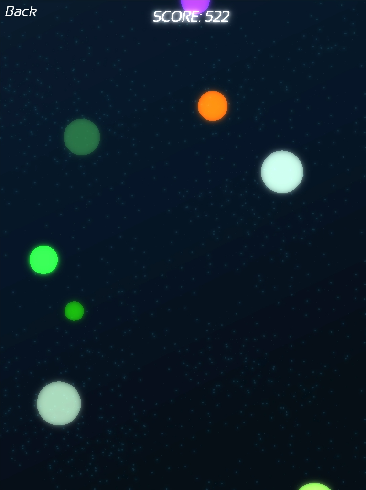

# BubblesCrush

A bubble-popping game built with C++ and SFML. Features colorful bubbles, particle effects, and smooth gameplay with bloom post-processing.



## Building

```bash
mkdir build
cd build
cmake ..
make
```

## Running

Execute the built binary to start the game.
